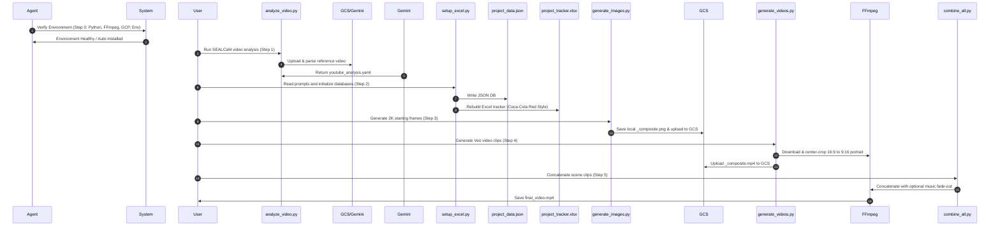

# Creative Video Cloner (Human-Product Composite Branding Video)

An advanced, end-to-end automation skill designed to analyze a branding video, extract its cinematic style, and synthesize a new 9:16 portrait branding video. It seamlessly integrates a client's product (e.g., a Coca-Cola can) into the hands of the reference video's human models, maintaining high-fidelity style cohesion.

---

## 1. Overview
The **Creative Video Cloner** automates the transition from a standard single-product advertisement to a high-end branding video. Instead of displaying a static product, it places the product in the hands of human models under studio lighting, following the camera moves and scenes of an inspiring reference video. 

This is accomplished by:
1. Parsing a reference MP4 video scene-by-scene using the **SEALCaM** (Subject, Environment, Action, Lighting, Camera, Movement) framework via Gemini.
2. Formulating a **composite scene strategy** that treats the reference human models as Subjects and the product image as a held Prop/Accessory.
3. Generating 9:16 portrait start frames with Vertex AI Imagen 3.
4. Animating those frames into 8-second clips using Vertex AI Veo, with a fallback cascade to resolve model constraints.
5. Post-processing and stitching the clips into a single master MP4 utilizing FFmpeg.

---

## 2. Folder Structure
The workspace is organized as follows:
```
.
├── .agents/                 # Workspace customizations & configuration root
│   ├── project_context.md   # Project context & tech stack specifications
│   ├── skills/              # Reusable agent skills
│   │   └── creative-video-cloner/
│   │       └── SKILL.md     # This comprehensive skill specification
│   └── .env                 # API Keys and bucket credentials (loaded via dotenv)
├── inputs/                  # User-provided assets (e.g., reference_youtube.mp4, cola.png)
├── outputs/                 # Output directory for generated images, videos, and trackers
└── tools/                   # Executable automation scripts
    ├── analyze_video.py     # Step 1: Video SEALCaM analysis tool
    ├── setup_excel.py       # Step 2: Database and Excel sync tool
    ├── generate_images.py   # Step 3: Vertex AI Imagen 3 generator
    ├── generate_videos.py   # Step 3b: Vertex AI Veo generator with FFmpeg crop cascade
    └── combine_all.py       # Step 4: Video stitching and music overlay tool
```

---

## 3. Critical Rules & Constraints

### ⚠️ GCS Retention Lock & Filename Collisions
* **CRITICAL RULE**: Due to strict Google Cloud Storage (GCS) bucket retention policies, existing files uploaded to GCS cannot be overwritten. 
* **ACTION**: Always append unique suffixes (such as `_composite.png` or `_composite.mp4`) when regenerating files. Do **NOT** reuse old filenames like `_merged` if they are already locked in GCS.

### 💰 Cost Warn Checkpoints
* Image and Video Generation cost money. **Always display estimated costs and ask for user confirmation before starting generation** in interactive terminal sessions.
* Use the `--yes` or `-y` CLI flags to bypass prompts **only** during automated agent executions.
  - Image generation: ~$0.09 per scene.
  - Veo Video generation: ~$0.40 per second ($3.20 per 8s scene).

### 🛑 Mandatory Checkpoints & User Approvals
To avoid wasting computational resources and project budget on undesired aesthetics, the agent must adhere to the following strict checkpoints:
1. **Checkpoint 1: Prompt Strategy Approval (Manual)**
   - **When**: After Step 1 (Video Analysis) and Step 2 (Tracker Sync).
   - **Action**: Present the generated `outputs/scenes_prompts.yaml` and the target branding video mapping (Subject vs. Prop/Accessory) to the user. Do **not** proceed to image generation until the user explicitly reviews and approves the prompts.
2. **Checkpoint 2: Budget Transparency Approval (Interactive)**
   - **When**: Prior to starting image generation (`generate_images.py`) and video generation (`generate_videos.py`).
   - **Action**: The script must output the estimated Vertex AI API cost (e.g., "$0.36 for 4 scenes of images", "$12.80 for 4 scenes of 8s videos") and ask: *"Do you approve this budget and wish to proceed?"* This check can only be bypassed using the `--yes` or `-y` CLI flags if executing in a fully automated, non-interactive environment.
3. **Checkpoint 3: Starting Frame Quality Check (Manual)**
   - **When**: After generating the composite starting frames (`_composite.png`).
   - **Action**: Present the generated images to the user and request visual quality verification. Ensure the product is integrated naturally into the hands of the models without anatomical or spatial distortions. **Always get explicit approval of the starting frames before animating them with Veo** (animating bad starting frames results in highly distorted videos and wastes $12.80+ of budget).
4. **Checkpoint 4: Master Video Review (Manual)**
   - **When**: After stitching the video with `combine_all.py`.
   - **Action**: Provide the path to `outputs/final_video.mp4` and summarize the runtime, transitions, and audio overlay details for final approval.

### 🔍 Model Constraints & Fallback Cascade
* Vertex AI Veo (`veo-2.0-generate-001`) with image conditioning (`reference_images`) does **not** support direct portrait `9:16` aspect ratio or `1080p` resolution.
* **ACTION**: The generator script must implement a **cascade fallback logic**:
  1. Try `9:16` at `1080p` (catch error)
  2. Try `9:16` at `720p` (catch error)
  3. Try `16:9` at `1080p` (catch error)
  4. Try `16:9` at `720p` (Success!)
* Once landscape `16:9` video is generated, download it and run local **FFmpeg center-cropping** to crop the central 9:16 portrait viewport.

---

## 4. Step-by-Step Process



### [Step 0] Environment Diagnostics & Auto-Setup
Before running any pipeline command, the **Antigravity agent must verify and configure the workspace environment autonomously**:
1. **Check Dependencies**: Run `pip install -r requirements.txt` if key packages like `google-genai`, `pandas`, or `openpyxl` are not installed or active.
2. **Check FFmpeg**: Run `ffmpeg -version` to verify if FFmpeg is on the host's `PATH`. If missing:
   - On **macOS**: Request user approval and execute `brew install ffmpeg`.
   - On **Linux**: Request user approval and execute `sudo apt-get update && sudo apt-get install -y ffmpeg`.
3. **Verify GCP Credentials**: Confirm local shell credentials by checking `gcloud auth application-default print-access-token` or checking active environment configurations. Prompt the user to run `gcloud auth application-default login` if credentials are unconfigured.
4. **Auto-Generate Env**: Check if `.agents/.env` exists. If missing, interactively prompt the user for:
   - `GCP_PROJECT_ID`
   - `GCS_BUCKET_NAME`
   - `GCP_REGION` (default: `us-central1`)
   Then, write these values automatically to `.agents/.env`.

### [Step 1] Video Analysis
Extract the timeline and stylistic characteristics of the reference video.
```bash
python3 tools/analyze_video.py inputs/reference_youtube.mp4 -o outputs/youtube_analysis.yaml
```

### [Step 2] Prompts & Tracker Sync
Write custom prompt strategies in `outputs/scenes_prompts.yaml`. Keep the human model as the Subject, and describe the product (e.g. Coca-Cola can) as a held prop. Run `setup_excel.py` to synchronize trackers.
```bash
python3 tools/setup_excel.py
```

### [Step 3] Starting Frame Generation
Generate starting frames matching the custom composite prompts.
```bash
python3 tools/generate_images.py --yes
```

### [Step 4] Motion Animation
Animate the generated images into 8-second clips.
```bash
python3 tools/generate_videos.py --yes
```

### [Step 5] Stitching & Post-Processing
Concatenate all generated scene clips into the final video, with optional music fade-out.
```bash
python3 tools/combine_all.py
```

---

## 5. Available Tools

### 1. `tools/analyze_video.py`
* **Purpose**: Performs a scene-by-scene analysis using the SEALCaM framework.
* **Arguments**:
  - `video_path` (Required): Path to local MP4 reference.
  - `-o, --output` (Optional): YAML output destination path.
  - `-m, --model` (Optional): Gemini model name (default: `gemini-3.5-flash`).

### 2. `tools/setup_excel.py`
* **Purpose**: Synchronizes YAML prompts with the JSON database and styled Excel tracking sheet.
* **Outputs**:
  - `outputs/project_data.json` (Primary JSON database)
  - `outputs/project_tracker.xlsx` (Excel dashboard with red headers and wrapped cells)

### 3. `tools/generate_images.py`
* **Purpose**: Calls Vertex AI Imagen 3 (`gemini-2.5-flash-image` fallback) to synthesize 2K starting frames.
* **Flags**:
  - `--yes`: Bypasses cost approval prompts.

### 4. `tools/generate_videos.py`
* **Purpose**: Synthesizes 8s cinematic animations with Vertex AI Veo (`veo-2.0-generate-001`).
* **Post-processing**: Centers and crops landscape video to portrait 9:16 layout using local FFmpeg:
  ```bash
  ffmpeg -y -i input.mp4 -vf "crop=floor(in_h*9/16/2)*2:in_h" -c:a copy output.mp4
  ```

### 5. `tools/combine_all.py`
* **Purpose**: Combines all `_composite.mp4` sequences into the final video.
* **Arguments**:
  - `--inputs` (Optional): List of video files (defaults to auto-discovering `outputs/generated_scene_*_composite.mp4`).
  - `--music, -m` (Optional): Background MP3/WAV file. Adds a 2-second fade-out at the end.

---

## 6. API & Integration Details

### Vertex AI Imagen 3 (Image Generation)
* **Model**: `gemini-2.5-flash-image` (fallback from `gemini-3.1-flash-image`)
* **Request Modalities**: `["IMAGE"]`
* **Configuration**:
  ```python
  config = types.GenerateContentConfig(
      response_modalities=["IMAGE"],
      image_config=types.ImageConfig(
          aspect_ratio="9:16",
          image_size="2K"
      ),
  )
  ```

### Vertex AI Veo (Video Generation)
* **Model**: `veo-2.0-generate-001`
* **Endpoint Location**: `us-central1`
* **Configuration (Fallback Success)**:
  ```python
  config = types.GenerateVideosConfig(
      aspect_ratio="16:9",
      resolution="720p",
      duration_seconds=8,
      reference_images=[
          types.VideoGenerationReferenceImage(
              image=types.Image(gcs_uri=ref_gcs_uri, mime_type="image/png"),
              reference_type="asset"
          )
      ]
  )
  ```

---

## 7. Database & Storage Schema

### JSON Database (`outputs/project_data.json`)
```json
{
  "project_name": "Coca-Cola Branding Video",
  "scenes": [
    {
      "scene_number": 1,
      "scene_name": "Outdoor Coca-Cola Can Clone",
      "start_image_prompt": "Prompt describing the model holding the product...",
      "video_prompt": "Motion prompt describing the model posing with the can...",
      "start_image": "https://storage.cloud.google.com/bucket-name/outputs/generated_scene_1_composite.png",
      "scene_video": "https://storage.cloud.google.com/bucket-name/outputs/generated_scene_1_composite.mp4"
    }
  ]
}
```

### Excel Tracker columns (`outputs/project_tracker.xlsx`)
1. **Project Name** (Wrapped, centered text)
2. **scene** (Dynamic name format: `Scene {N} - {Scene Name}`)
3. **start_image_prompt** (Long text wrap)
4. **video_prompt** (Long text wrap)
5. **start_image** (Clickable authenticated GCS browser URL)
6. **scene_video** (Clickable authenticated GCS browser URL)

---

## 8. Quick Start

Ensure GCS buckets and GCP SDK credentials are set up. Then run:

```bash
# 1. Analyze your reference branding video
python3 tools/analyze_video.py inputs/my_reference.mp4 -o outputs/youtube_analysis.yaml

# 2. Write your scenes_prompts.yaml with human-product interactions and sync
python3 tools/setup_excel.py

# 3. Synthesize your starting frames
python3 tools/generate_images.py --yes

# 4. Generate Veo animations (auto center-cropped to 9:16)
python3 tools/generate_videos.py --yes

# 5. Compile into the final master cut
python3 tools/combine_all.py
```
Your high-end, customized composite branding video will be compiled and saved to `outputs/final_video.mp4`!

---

## 9. Troubleshooting & Lessons Learned

When orchestrating or refining this pipeline, future agents and developers should keep the following critical troubleshooting insights in mind. These represent actual edge cases resolved during the initial system building.

### 🛑 1. GCS Write Failures (`retentionPolicyNotMet`)
* **Symptom**: During image or video upload, the console throws a `retentionPolicyNotMet` error and aborts the upload.
* **Root Cause**: The target Google Cloud Storage bucket has strict object retention policies enabled. Attempting to overwrite an existing locked filename (such as old `_merged.png` or `_merged.mp4` files from a previous run) is blocked by GCS security rules.
* **Resolution**: Always append unique suffixes (such as `_composite`) or add unique hashes (e.g. timestamps) to filenames when regenerating files. Never assume you can overwrite GCS objects with matching names.

### 🎥 2. Veo Image-Conditioned Portrait Failures
* **Symptom**: Triggering Vertex AI Veo (`veo-2.0-generate-001`) with image conditioning in 9:16 portrait ratio throws unsupported parameters or resolution errors.
* **Root Cause**: The current Veo 2.0 image-conditioning API has strict constraints on resolution and aspect ratio when taking input reference images; direct portrait conditioning is not fully supported out-of-the-box.
* **Resolution**: Implement a **Resolution & Aspect Fallback Cascade**. 
  - The script must try `9:16` at `1080p` -> `9:16` at `720p` -> `16:9` at `1080p` -> and finally fallback to **`16:9` at `720p`** which is extremely stable.
  - Once landscape video is generated, download it and run local **FFmpeg center-cropping** to crop the central 9:16 viewport:
    ```bash
    ffmpeg -y -i input.mp4 -vf "crop=floor(in_h*9/16/2)*2:in_h" -c:a copy output.mp4
    ```

### 📊 3. Database Overwrite / Link Wiping
* **Symptom**: Re-running `setup_excel.py` to synchronize prompts overwrites the `outputs/project_data.json` database and wipes out all previously generated starting image URLs and video URLs.
* **Root Cause**: `setup_excel.py` has a lightweight YAML loader that re-initializes the database with empty strings for `"start_image"` and `"scene_video"`.
* **Resolution**: If prompts are updated, modify them directly in `scenes_prompts.yaml` and run `setup_excel.py` **before** image/video generation. If you already have generated assets and wish to regenerate only the Excel sheet without wiping GCS links, write a script to load the existing JSON, edit prompts inline, and then call `write_excel_from_json()` directly rather than re-initializing.

### 🌐 4. Authentication / GCS Permission Blockages in Excel
* **Symptom**: Clicking on generated URLs inside the Excel tracker sheet in a browser results in `Access Denied` XML errors.
* **Root Cause**: The URLs are formatted using public domain structures (`https://storage.googleapis.com/...`), but the bucket or files do not have public read permissions.
* **Resolution**: Format GCS URLs using the browser-authenticated link structure:
  - **Correct format**: `https://storage.cloud.google.com/{bucket_name}/{object_name}`
  This prompts the user's browser to authenticate with their active Google Account, allowing secure, authenticated access to private project assets.
